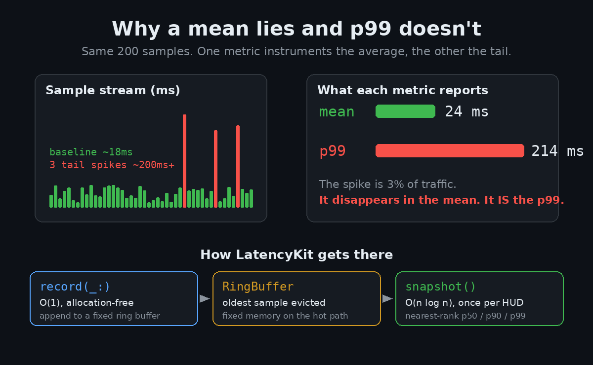

# LatencyKit — a fixed-memory rolling-percentile recorder

A tiny, dependency-free Swift package for instrumenting latency (or any `Double`
stream) on a hot path: record samples in **O(1)** with no per-sample allocation,
then read **p50 / p90 / p99** over a fixed rolling window whenever you want to
refresh a HUD.

This is the demo repo for the article
**"Your Tests Pass. That's Not the Senior Bar."** — a piece on testing strategy
and performance engineering as the two things a senior iOS interview actually
probes. Article: **[Your Tests Pass. That's Not the Bar for Senior iOS.](https://medium.com/p/5d8d44a00672)**



## Why it exists

A mean is the metric that lies. Three requests out of a hundred spiking to 200ms
vanish inside a 24ms average — and those three requests are the ones your users
feel. The whole point of this package is to make the **tail** cheap enough to
measure continuously, so you instrument p99 instead of a comforting average.

The interesting part isn't the API. It's that every bug in something like this
lives in an edge case: the ring buffer's eviction order, the percentile rank at
the boundary, a `NaN` sample poisoning the window. So the test suite is written
to encode those invariants, not to pad a coverage number.

## What's inside

- `RingBuffer<Element>` — fixed-capacity, O(1) append, oldest-evicted, fully
  bounds-checked (a bad capacity degrades to 1 instead of trapping).
- `PercentileCalculator` — nearest-rank percentiles, so every reported number is
  a value that actually occurred.
- `LatencyRecorder` — the public façade: `record(_:)`, `snapshot()`, `reset()`.

```swift
var recorder = LatencyRecorder(capacity: 200)

recorder.record(18.4)   // O(1), allocation-free — safe on every frame
recorder.record(214.0)  // a tail spike

if let s = recorder.snapshot() {
    print(s.mean, s.p50, s.p90, s.p99)   // the mean hides what p99 surfaces
}
```

A rolling window means old spikes age out instead of haunting your percentiles
forever:

```swift
var r = LatencyRecorder(capacity: 3)
[1, 2, 3, 4, 5].forEach { r.record($0) }
r.snapshot()?.min   // 3, not 1 — the first two samples were evicted
r.snapshot()?.p50   // 4
```

## Running it

**Library + tests (headless):**

```bash
swift build
swift test
```

**The SwiftUI demo app:** open `Demo/Demo.xcodeproj` in Xcode, pick the `Demo`
scheme with any iOS Simulator, and Run. Tap "Record a burst with a tail spike"
and watch the mean barely move while p99 jumps — the point of the whole package,
made visual. The app consumes the library as a **local Swift package** (see the
`XCLocalSwiftPackageReference` in the project), so there's nothing else to wire
up.

## Verification status (honest)

- ✅ `swift build` succeeds and `swift test` passes **18/18** on Swift 6.0.3 —
  ring-buffer eviction and wraparound, nearest-rank percentiles at the p0/p50/
  p90/p99/p100 boundaries, `NaN`/`inf` rejection, rolling-window eviction, and a
  `measure`-based throughput guardrail on the record path.
- ✅ `Demo/Demo.xcodeproj/project.pbxproj` is hand-authored, uses a local package
  reference (no crash-prone `.executableTarget`), and was checked for balanced
  braces/parens; the shared scheme is valid XML.
- ⚠️ The SwiftUI demo app was **not** launched on a Simulator in the run that
  generated this repo — the machine's automation was occupied by another session
  at build time, so the live run was deliberately skipped rather than forced. The
  UI layer instead got a `swiftc -parse` syntax check and manual review. If you
  open it in Xcode, that's the last mile.

## License

MIT.

---

Article: **[Your Tests Pass. That's Not the Bar for Senior iOS.](https://medium.com/p/5d8d44a00672)**
